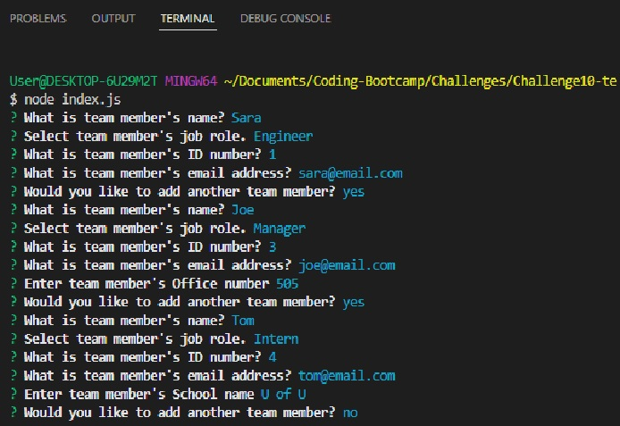
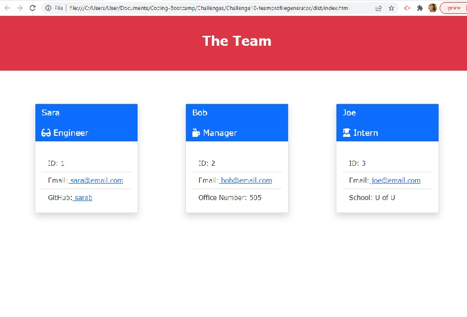

# Challenge10- Team Profile Generator

## Description
This project is a Node.js command-line application that takes in information about employees on a software engineering team and generates an HTML webpage that displays summaries for each person. There are also unit tests for each part of code.

## Usage
Please refer to the following link to view a video demo to see how the app can be used.

https://drive.google.com/file/d/1jU0Dq2id340Lgjm0h-CUh7L2xQoORCH9/view?usp=sharing

## Screenshot
Below is a screenshot of the command-line prompts as well as the generated HTML rendered in the browser.

## Contributors
This challenge was coded by Sara Barnett.
